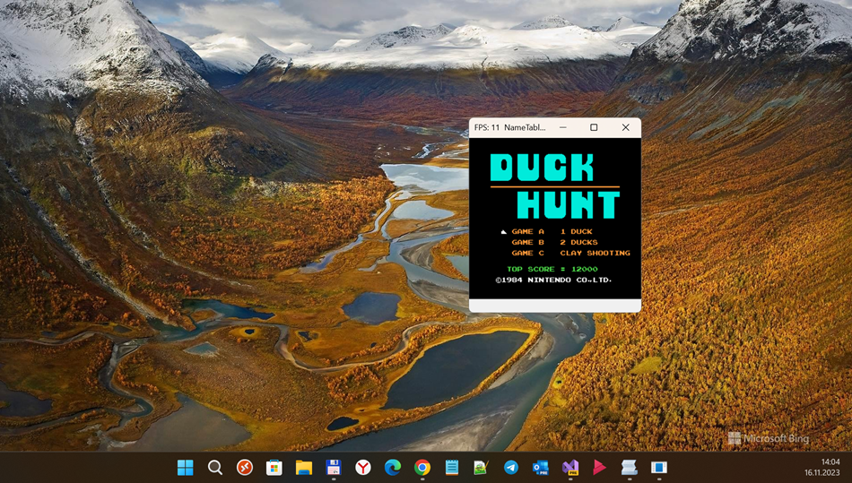
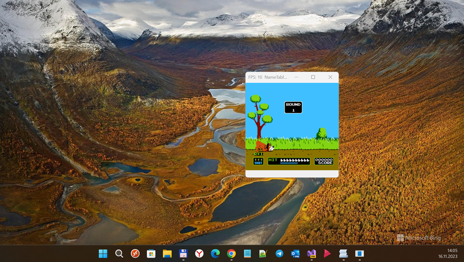
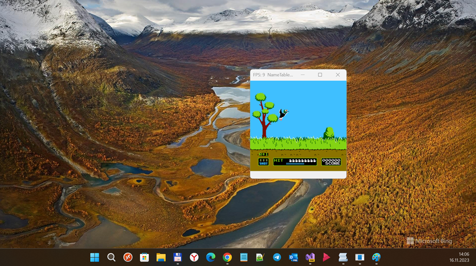

# NEmu
RnD of TinerasNES.

## About
Thisis just another NES emu for my learning purposes only. 

Forked from [TinerasNES_CSharp](https://github.com/tineras/TinerasNES_CSharp).  

## My 2 cents
- Fast R.E.
- I modified a lot
- Failed attemp to easy/quickly realize APU ... so no sound, holy shit! ;) 

## Screenshot

## Joypad "emulation" via k-b-d input
  
Q - A

E - B

Z - Select

C - Start

W - Up, S - Down, A - Left, D- Right
  
## References
- https://github.com/tineras Original author of "TinerasNES" emulator
- https://github.com/tineras/TinerasNES_CSharp hided/deleted original "TinerasNES" project

## ..
As is. No support. RnD only.

## .
[m][e] 2023
